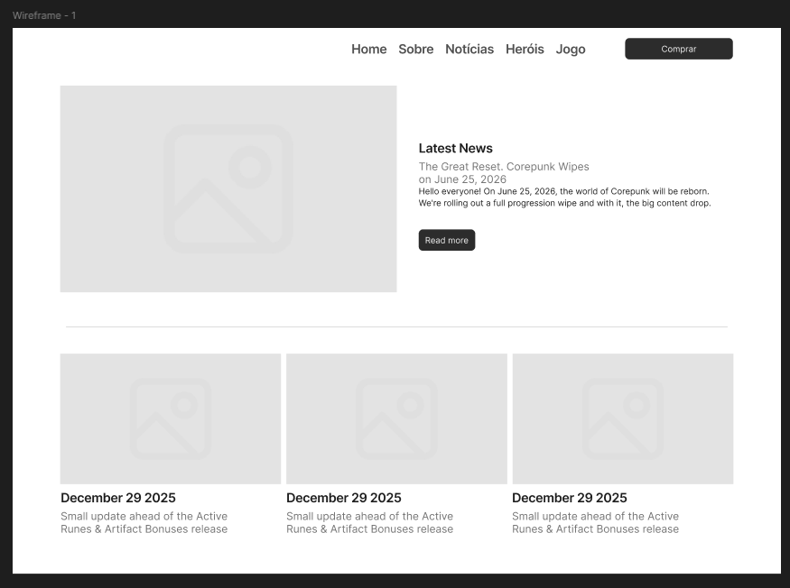

<h1>
    
</h1>

<h3 align="center">
     <a href="https://www.figma.com/proto/GNhz3Y3cGn3lmyEUwrwDlV/Wireframe-de-M%C3%A9dia-Fidelidade?node-id=0-1&t=HikvegVz91rzpQny-1">Acessar a wireframe</a>
<h3 >

# Indice

- [Sobre](#-sobre)
- [Tecnologias Utilizadas](#-tecnologias-utilizadas)

## 🔖&nbsp; Sobre

O projeto **Página de Notícias** é um Redesign que foi criado dentro do curso **Formação UI/UX Designer** com o intuito de colocarmos em prática o conteúdo estudado sobre wireframe.

---

## 🚀 Tecnologias utilizadas

O projeto foi desenvolvido utilizando as seguintes tecnologias

- [Figma](https://www.figma.com/pt-br/design/)

---

Desenvolvido por Taigo Amazonas - Criação de um projeto de Wireframe de Média Fidelidade para o 1º desafio da formação UX Desinger DIO
